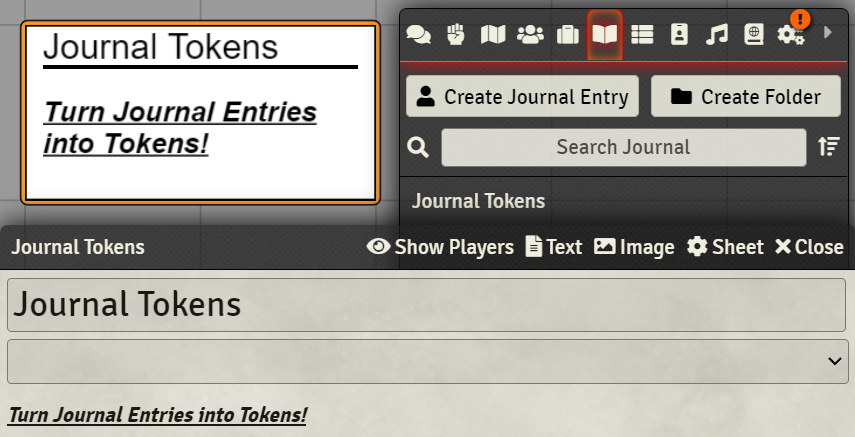
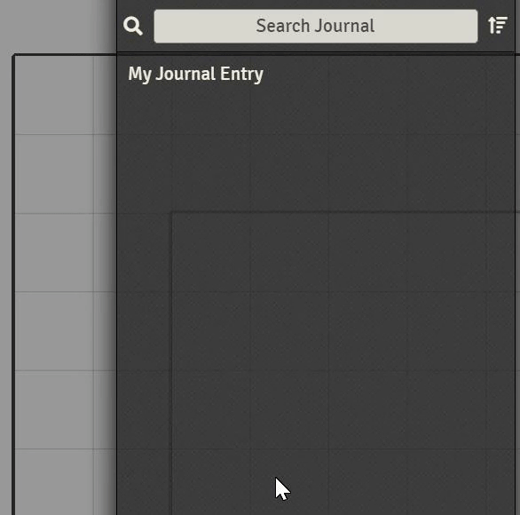

# Journal Tokens

A module for Foundry VTT that adds the ability to display Journal Entries as Tokens.

This was developed over the course of the Christmas break and represents a
prototype. It is my first real time using JavaScript and my first time working
with Foundry VTT and as such if I were to start this again I would likely
aproach it much differently.

For now I intend to polish this up and implement the currently [planned features](#planned-features).

## Installation

Manifest file: https://raw.githubusercontent.com/AnthonyRO/journal-tokens/main/module.json

## How To Use

NOTE: This module requires [FVTT libWrapper](https://foundryvtt.com/packages/lib-wrapper) to work.

### Creating Journal Tokens

Right click on a Journal Entry and click "to token".

### Editing Journal Tokens

Click "Save Entry" will cause all Journal Tokens in the active scene to update
and display the latest Journal Entry information.

The actual Token can be resized as with a normal token and a tint can be applied.

## Planned Features

In no particular order the below represents the list of features planned to be
implemented:

* Copy and Paste
* Copy and Paste between scenes
* Global settings
  * align
  * fontFamily
  * fontSize
  * fontStyle
  * wordBreak
  * backgroundColor
  * fontColor
  * borderColor
  * defaultTokenSize
* Per Journal Entry settings
  * (Same as Global settings)
* Per Token settings
  * (Same as Global settings)
